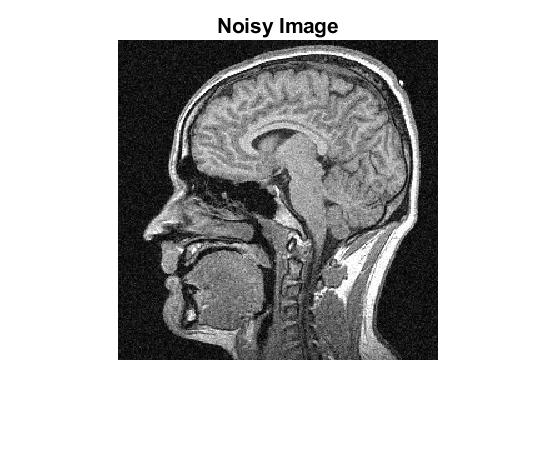
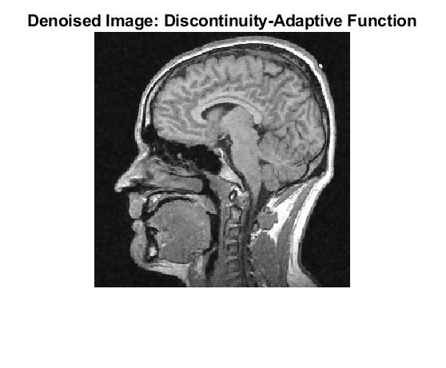

# Bayesian Image Denoising

</img>
</img>
</img>

A *Maximum-A-Posteriori* (MAP) Bayesian approach for image denoising that uses Markov Random Fields (MRFs) as the prior model

## Usage:
See [`code/main.mlx`](code/main.mlx) and run it cell by cell.

## Documentation:
- [`code/main.mlx`](code/main.mlx): The main script/driver program
- **General Functions:**
  - [`code/rrmse.m`](code/rrmse.m): Returns the RRMSE (Relative Root Mean Squared Error) between two images
  - [`code/objectiveAndGrads.m`](code/objectiveAndGrads.m): Returns the objective function value and the corresponding gradients
  - [`code/adaptiveGradientDescent.m`](code/adaptiveGradientDescent.m): Gradient Descent with a dynamic learning rate/step size
- **MRF Prior:**
  - [`code/fourNeighborSystem.m`](code/fourNeighborSystem.m): The standard four-neighbor system for each pixel
  - [`code/quadraticPrior.m`](code/quadraticPrior.m): The quadratic loss function
  - [`code/huberPrior.m`](code/huberPrior.m): The Huber loss function
  - [`code/dafPrior.m`](code/dafPrior.m): A discontinuity adaptive function
- **Noise Model:**
  - [`code/weightedNoiseModel.m`](code/weightedNoiseModel.m): Contains implementations of the Gaussian and the Rician noise models 
